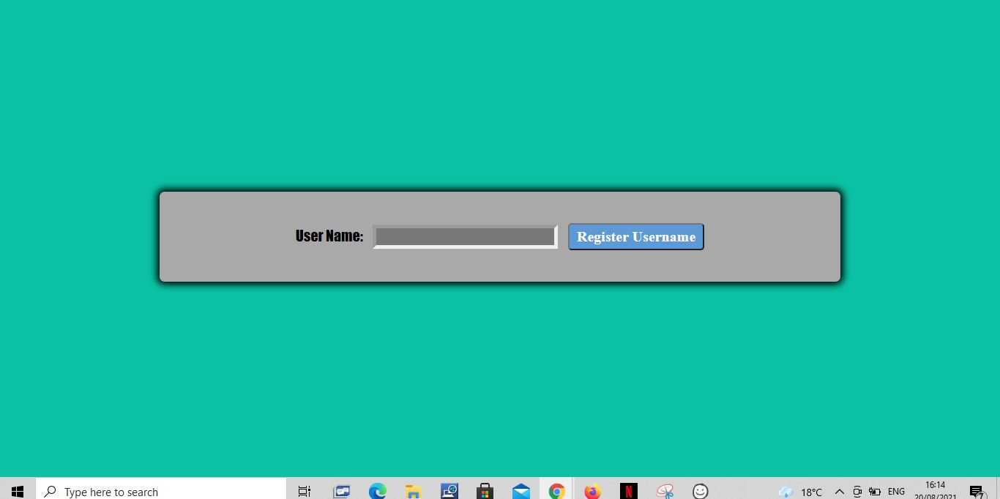
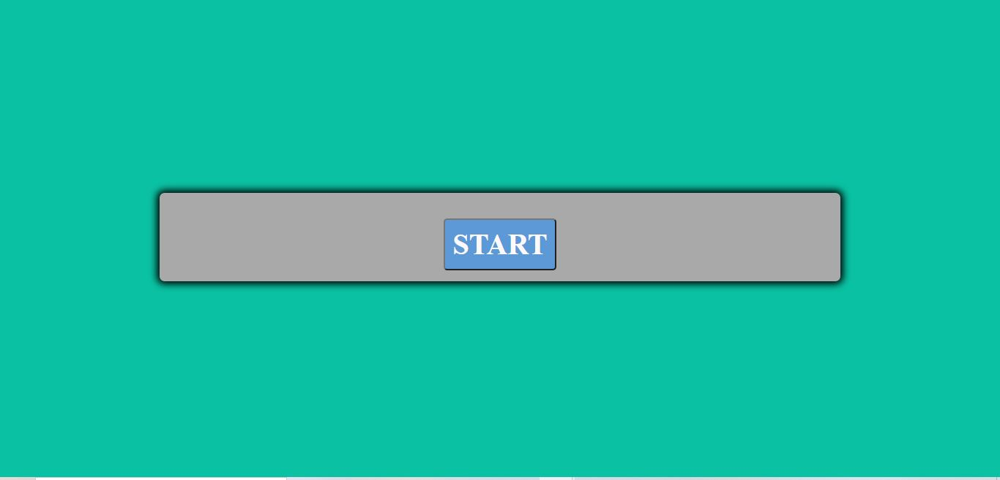
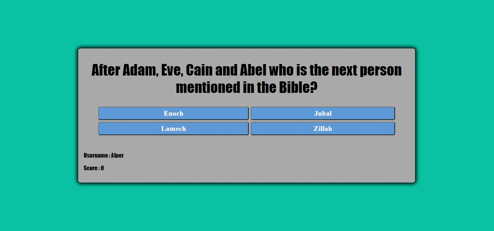
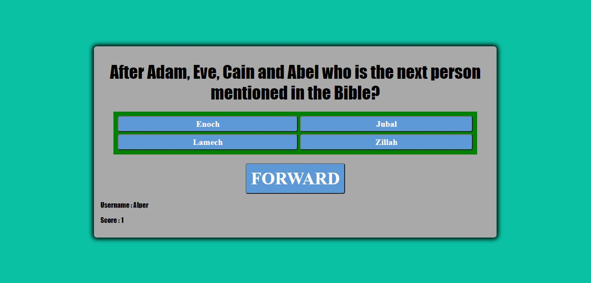
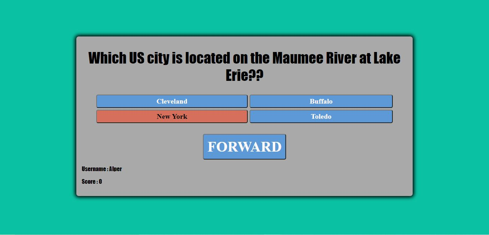
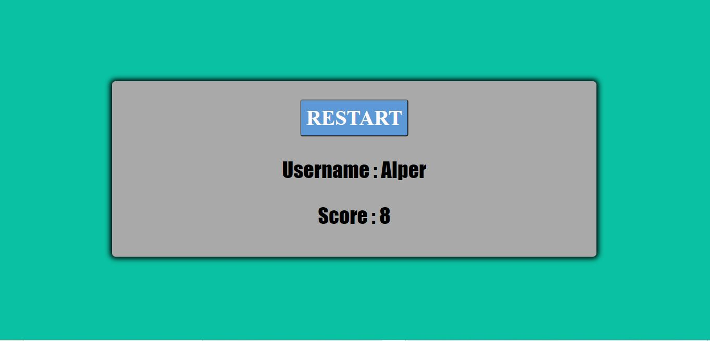

# GENERAL KNOWLEDGE GAME   
(Developer Alper Kanburoglu)

[link to live page](https://alperkan1.github.io/JSGENERALQUESTIONGAME/index.html)

# Contents

1. [User Experience](#1-user-experience)
   1. [Target User](#i-target-user)
   2. [User Stories](#ii-user-stories)
   3. [User Requirment](#iii-user-requirment)
2. [Aims](#2-aims)
   1. [User Aims](#i-user-aims)
   2. [Site Creater Aims](#ii-site-creater-aims)
3. [UX](#3-UX)
   1. [Structure](#i-structure)
   2. [Design and Colour](#ii-design-and-colour)
   3. [Font](#iii-font)
   4. [Wireframes](#iv-wireframes)
4. [Features](#3-Features)
   1. [Navigation Bar](#i-navigation-bar)
   2. [The Landing Page](#ii-the-landing-page)
   3. [Community Information](#iii-community-information)
   4. [Special Flights Section and Locations](#iv-special-flights-section-and-locations)
   5. [Survey Page](#v-survey-page)
   6. [Images](#vi-images)
   7. [video](#vii-video)
   8. [Footer](#viii-the-footer)
   9. [404 Page](#ix-404-page)
   10. [Thank You Page](#x-thank-you-page)
   11. [Features Left To Implement](#xi-features-left-to-implement)
5. [Technologies Used](#5-technologies-used)
   1. [Code Used](#i-code-used)
   2. [Tools and Framework](#ii-tools-and-framework)
6. [Testing](#6-testing)
   1. [HTML Validation](#i-html-validation)
   2. [CSS Validation](#ii-css-validation)
   3. [Accessibility](#iii-accessibility)
   4. [Speed test](#iv-speed-test)
   5. [Tests On Devices](#v-tests-on-devices)
   6. [Browser](#vi-Browser)
   7. [Have the User Stories Been Answered](#vii-have-the-user-stories-been-answered)
7. [Bugs](#7-bugs)
8. [Deployment](#8-deployment)
9. [Credits](#9-credits)
   1. [Media](#i-media)
   2. [Code](#ii-code)

## 1. User Experience

### i. Target User

- A site for people to use to educate staff about a product via questions that they can choose and change.
- A fun site for general knowledge game.
- It is for people who are competitive and like to win.
- For people to play with others.
- For people who like a intrative game.

### ii. User Stories

#### First Time User 

- As a first time user, I want to be able answers question and be notified if correct or not.
- As a first time user, I want to be able register my username.
- As a first time user, I want to be able to re play with questions in a different squince.
- As a first time user, I want to be able to get my score.
- As a first time user, I want to be able to see visually if the answers are correct or not.
- As a first time user, I want to be able to hear if my answers are correct or not..

#### Returning User

- As a returing user, I want to be able to change questions depending what the customer wants. 
- As a returing user, I want to be able to get the quesions in a different order.
- As a returing user, I want to be able to get my score.
- As a returing user, I want to be abe to register a new user name.

#### Site Owner 

- As a site owner, I want users to be able to change the questions.
- As a site owner, I want users to be able to use the same questions but in a different order.
- As a site owner, I want users to be able to have a easy and quick navigation from one question to another.
- As a site owner, I want users to be able to see the feedback when they get a correct answer or a wrong answer.
- As a site owner, I want users to hear the feedback if they have got the correct answer or not.
- As a site owner, I want users to be able to track the score.
- 
### iii. User Requirement

- Score tracking system.
- To be able to hear feedback if they got the answer right or wrong.
- To be able to see the feedback if the user got the answer right or wrong.
- Responsive to all devices sizes.
- Visually pleasing design and layout.
- To be abe to register a username and get a allert to state that the usernam has been registered.
- To change the code easily to have new questions.

## 2. Aims

### i. User Aims

- To b able to test peoples general knowledge.
- Have the ability to change the questions depending on the clients requirments .
- To have easly readable text and scores.
- Quick navigation from question to question.
- To get feedback visually and by audio if you got the answer right or wrong.

### ii. Site Creater Aims

- To be able to register a username.
- To to be able to get a score at the end to see how wel i did.
- To have the questions in a different order every time you play.
- To have questions that are easly changed.
- To for the user to have enought fun to want to come back and beat their last score.

## 3. UX

### i. Structure 

The site is structured in a visually appealing manner which draws the eye down the page to submit the users name. The site implements a user freindly navigation with clear and easly readable buttons. The colors complment the user box and buttons. The buttons and back ground change colour depending on the correct or wrong answer. 

#### Home Page 

On the home page you can see an registrations bax. Once you have registered it will show an alert to confirm the registration. Then it comes up with the button to start the game. The question coes up with 4 options. You choose the correct answer and the back ground of the buttons go green and the audio says yes. If you get the wrong answer the button goes red and it states audio as wrong. The user name is at the bottom left and the score is below that. The score increases by one if you get the correct answer and if you dont it does not increase. Once all the questions have been answered the it goes to the final page showing the sore username and restart button.

#### 404 Page 

This is a black background with white writing and blue link code.

### ii. Design and Colour

The site was desinged with background colours that compliment and enhance the images used. The colours are bright, cool tones to reflect the cool colors of correct green and red answers. The design of the site was choosen to instil the emotion of playing a fun game of greens and reds with a blue that compliments the colour.  

### iii. Font

Fantasy with a backup of roboto and sans-serif was used on the page to clearly show the questions and the answer buttons. 

### iv. Wireframes

Start

   

Question

         

result

   

## 4. Features

### i. Registry
- The page opens with the Input asking for Username.
- You register your username easily with a sleek looking input box.
- The person then gets a alert to state that they have registered.

Register

   

### ii. Start
- Once regitered you then are moved to the Start screen.
- 

Start

 

### iii. Question
- This then moves to the questions with 4 answer buttons.
- Once you choose your answer if correct background of buttons goes green and audio that states yes.
- If incorrect the button goes red and the audio states wrong.
- Then the forward button appears.
- The username is at the bottom Left.
- The score is below the username with the score increasing by one for each right answer.

Question

 

Right Answer

 

Wrong Answer

 

### iv. Reset
- This is the section where your tolad your final score.
- Your User name and score is moved to the middle and made larger.
- The restart button is also at the top to restart the game again.

Restart

 

### v. 404 Page
-The 404 page is a error page where it wil re direct the user back to the game.

404 Page

  

### xi. Features Left To Implement
- To have a leader board.
- To use videos as a part of the questions.
- to be able to select what type of question the user would like to answer.
- To be able to play a multiplayer game.

## 5. Technologies Used

### i. Code Used

- CSS
- HTML
- JS

### ii. Tools and Framework

- Git 
- Gitpod 
- Github
- Balsamiq
- Google Fonts
- Font Awsome
- Google Fonts

## 6. Testing

### i. HTML Validation

The W3C Markup Validation Service used to validate the HTML code. On page gallery and survey warning for sections not having a heading. For desing reasons that was chosen.

Home

 

Gallery

 

Survey

 

Thank You

 

404

### ii. CSS Validation

W3C jigsaw Validation was used to test the code with a direct input. 1 warning and no errors are showing.

CSS Validation

### iii. Accessibility

The WAVE WebAIM acessibility tool was used to confirm check that the site is up to standart with 0 errors.

Home

 

Gallery

 

Survey

 

Thank You

 

404

### iv. Speed test

Google Lighthouse was used to speed test for mobile devices and for destop. All pages performed above 90%.

#### Mobile device

Home

 

Gallery

 

Survey

 

Thank You

 

404

#### Desktop

Home

 

Gallery

 

Survey

 

Thank You

 

404

### v. Testing on Devices

I used the inspect tool on Google Chrome to test the responsiveness on different devices.

- TOSHIBA Satelite 
- I Phone 8 Pluss
- Lenova ThinkPad
- Windows Surface Pro 5 

### vi. Browser

The site is working on the follwing browsers

- Google Chrome
- Microsoft Edge
- Microsoft Explorer 
- Mozilla Firefox

### vii. Have the User Stories Been Answered

#### As a first time user, I want to be able to see other users photos.

The gallery page that can be accessed from the navigation bar shows photos.

| Element | Aim | Result |
| ------- | ----|----------|
|Gallery| The aim is to show people photos at Dublin Airport| works on gallery page|

Gallery

  

#### As a first time user, I want to be able to locate the best locations for plane spotting at Dublin Airport.

On the landing page there is a locations heading with a map to show best location to go spotting.

| Element | Aim | Result |
| ------- | ----|----------|
|Map| The aim is to show people the bet place to go spotting| works on lading page|

Locations

 

#### As a first time user, I want to get the most up to date flight information.

On the landing page there is a schedule heading with a up to date lading and take off information.

| Element | Aim | Result |
| ------- | ----|----------|
|Schedule| The aim is give the most up to date information on take off and landings at Dublin Airport| works on lading page|

Flight times

 

#### As a first time user, I want to find the social media links for the the community.

On all pages on the footer you can see the social media links.

| Element | Aim | Result |
| ------- | ----|----------|
|Social Media| The aim is to have links to all the social media links on every page| works on all pages|

Footer

#### As a first time user, I want to be able to give my feedback.

On the survey page we can collect the feedback from our users.

| Element | Aim | Result |
| ------- | ----|----------|
|Survey| The aim is collect information and feedback| works on Surveypage|

Survey

  

#### As a first time user, I want to be able to contact the society.

On all pages the user can navigate to the footer and see the contact details.

| Element | Aim | Result |
| ------- | ----|----------|
|Footer| The aim is to see the footer on all pages with the contact details and on all devices| works on all pages|

Footer

#### As a returning user, I want to be able to get the updated schedules for flights arriving and departing from Dublin Airport.

On the landing page the schedule is updated for special flights that spotter would like to view.

| Element | Aim | Result |
| ------- | ----|----------|
|Schedule| The aim is to give the most up to  date information on take off and landings at Dublin Airport| works on lading page|

Flight times

 

#### As a returning user, I want to be able to see new images.

We ask our site visitors to send us their images via e-mail allowing updates to the gallery page.

Contact

 

#### As a returning user, I want to be able to share images.

We ask our site visitors to send us their images via e-mail. This allows updates to the gallery page.

Contact

 

#### As a returning user, I want to have the oportunity to get unique experiences.

By collecting information on our survey page we will be creating a member database. With this we will be able to contact members and offer special tours.

| Element | Aim | Result |
| ------- | ----|----------|
|Survey| The aim is collect information and feedback| works on Surveypage|

Survey

  

#### As a site owner, I want to be able to contact users with news letters.

By collecting information on our survey page, we will be creating a member database.

| Element | Aim | Result |
| ------- | ----|----------|
|Survey| The aim is collect information and feedback| works on Surveypage|

Survey

## 7. Bugs

| bugs | Corrections|
| ------- | --- |
| CSS code giving the error of H3 cannot be used as a label | Take the h3 heading out of the label and have it as a separate element in the survey |
| When trying to put the Map and the schedule box beside each other the map went below.| Used a flex to align the two elements|
| On the submit page when you submitted the survey the page went to a 404 page| Created a new page and linked it to the submit button|
| Gallery photos become too small when you use a small device| Change the element to a inline block with a @media query|
| the text box on the 404 page was not moving and over flowing on smaller pages| Create a div with in the image to contain the text box|
| After deployment the style.css was not working|Check the style.css file route on the HTML chnage it to the correct route.|

## 8. Deployment

The site was deployed using GitHub. The page is pubic and can be reached with the below link.

#### Page Deployment

[GitHUb page link](https://github.com/alperkan1/MS1-Dublin-Airport-Plane-Spotters)

- On git hub go to the settings.
- Then choose the Pages option on the left hand headings.
- Choose the branch as master.
- Then deploy it. It will take a moment and then a link will be created with the massage "your site is published at https://(your github page).github.io/MS1-Dublin-Airport-Plane-Spotters/index.html". 
- Then the link is live.

#### To run you can fork the project form the link below 

[GitHUb page link](https://github.com/alperkan1/MS1-Dublin-Airport-Plane-Spotters)

- On the top right it will give you the forking option

#### To Clone use the link below  

[GitHUb page link](https://github.com/alperkan1/MS1-Dublin-Airport-Plane-Spotters)

- Use the Code button
- Choose your cloning option (HTTPS SSH GITHUB CLI)
- Using git bash, paste the link.
- Use the code in your directory.

## 9. Credits

Images not referenced are developers images

### i. Media

- Image on Survey page from [Manfred Irmer](https://www.pexels.com/photo/in-flight-airliner-in-grayscale-photo-587063/) from the site pexels
- image on Lading page for mobile devices [Nagative Space](https://www.pexels.com/photo/airport-travel-waiting-terminal-34145/) from the site pexels
- Image on the thank you page [Joël Super](https://www.pexels.com/photo/gray-air-vehicle-with-yellow-coated-cable-around-docking-wheels-2315265/) from the pexel
- Image on the 404 page is from Turkish Airlines media cloud.

### ii. Code 

- On the landing page the circle image is inspired from the love running project code institute.
- On the landing page the schedule code modified from the love running project code institute.

[Back to the top](https://github.com/alperkan1/Dublin-Airport-Plane-spotters#Dublin-Airport-Plane-Spotters)

